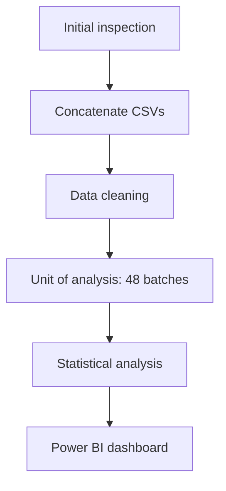

# Packinghouse and Transport Chain Assessment of the Effect of Hot Water Treatment (HWT) and Season on Physiological and Pathological Loss of Carabao Mango (*Mangifera indica*)

Two-year analysis of mango postharvest loss through two chain nodes.

> **Data disclosure:** The dataset is **synthetic, generated with an LLM (Large Language Model)** to simulate the
> Philippine carabao mango chain conditions. Findings describe the simulated
> values and are not for real-world decisions.


---

## Problem statement
Carabao mango is a high-value fruit in the Philippines, available year-round because of flower induction.
The fruit loses value through several routes, but mainly through **physiological loss** (weight loss, shriveling) 
and **pathological loss** (anthracnose and stem-end rot). 

Hot water treatment (HWT) is a low-cost protocol that reduces these categories of postharvest losses; 
its efficacy along the packinghouse and transport chain nodes across seasons and years needs to be measured
to validate its loss mitigation ability.

This project asks:
1. Does HWT reduce physiological and pathological loss?
2. What drives pathological loss: season, location, or ambient conditions?
3. Is the reduction in loss due to a better treatment or an increase in adoption for the year 2024?
4. Can fruit price be used as an indicator of increased pathological loss?

---
## Data
| Item | Detail |
|---|---|
| Source | Synthetic (LLM-generated) |
| Files | `mango_loss_2023.csv` (48 rows), `mango_loss_2024.csv` (49 rows, 1 duplicate) |
| Design | 24 batches/year × 2 chain nodes (packinghouse, transport); 4 provinces |
| Variables | Treatment (HWT yes/no, temperature, duration), season, cultivar, weights, physiological and pathological loss %, dwell time, ambient temperature and RH, price |
| Dictionary | [`mango_dictionary.csv`](1_Data/2_Processed_Data/mango_dictionary.csv) |

---

## Methodology



---

## Key findings

https://github.com/user-attachments/assets/a4f56ca5-0f0a-4d2b-b0d9-fc4baff56ceb

1. **HWT reduces pathological loss by 40% and physiological loss by 33%**
   - Pathological loss from 7.51% to 4.47%.
   - Physiological loss from 7.39% to 4.96%.
2. **Wet season adds +4.1 percentage points to pathological loss.**
   - It is the largest risk factor, larger than the treatment effect.
   - However, it has no effect on physiological loss.
4. **An increase in adoption rate in 2024 reduced losses.**
   - Treated batches went from 4 to 12 (17% → 50%), while the per-batch treatment effect stayed the same in both years.
5. **Price cannot be used as an indicator for an increased pathological loss.**
   - The raw correlation (r = 0.75) collapses to r = 0.10 within season.
   - Season drives both price (scarce wet-season supply) and pathological loss (rain-spread spores).
6.**No effect from**
   - province, chain node, dwell time, ambient temperature, or humidity.

---

## Recommendations
- Promote the use of HWT to further reduce loss, especially in the wet season (Jun–Nov).
- Keep treatment within the validated 52–55 °C / 5–10 min window; equipment should hold this range reliably rather than exceed it.
- Measure HWT operating cost per batch to compute net benefit.

---

## Repository structure
```
1_Data/
  1_Raw_Data/              original CSVs (never modified)
  2_Processed_Data/
    mango_rows.csv         clean row-level data (96 rows)
    mango_batch.csv        one row per batch (48)
    mango_balance.csv      group balance check
    mango_dictionary.csv   column definitions
2_Notebook/
  mango_project.ipynb      full analysis
3_Dashboard/
  mango_project.pbix              Power BI file
  mango_project.pdf               static export
  mango_project_screenshot.png    preview image
  mango_project_dashboard.mp4     interaction demo
```

---

## Access and reproduce
- **Live dashboard:** [View](https://app.powerbi.com/view?r=eyJrIjoiNWEyYTczMTUtZTM3ZS00ODVjLTliZDMtMTcwZTc4MDNlYTJlIiwidCI6ImJkMDNhNzM1LTJhYTMtNGNjYS05NzIyLTJhZTQ5MjlhYjNlYyIsImMiOjEwfQ%3D%3D)
- **PDF:** [mango_project.pdf](3_Dashboard/mango_project.pdf)
- **Power BI file:** [mango_project.pbix](3_Dashboard/mango_project.pbix) (open in Power BI Desktop)
- **All files:** green **Code** button → **Download ZIP**

```bash
pip install -r requirements.txt
jupyter notebook 2_Notebook/mango_project.ipynb
```

---
## Tools
Python (pandas, NumPy, SciPy, Matplotlib) · Power BI · Git/GitHub

*Developed with AI assistance (Claude) for code review, statistical guidance, and
methodology checks. All analytical decisions, interpretations, and the dashboard
design are my own.*

## Author
**Joshua B. Mirabueno**
